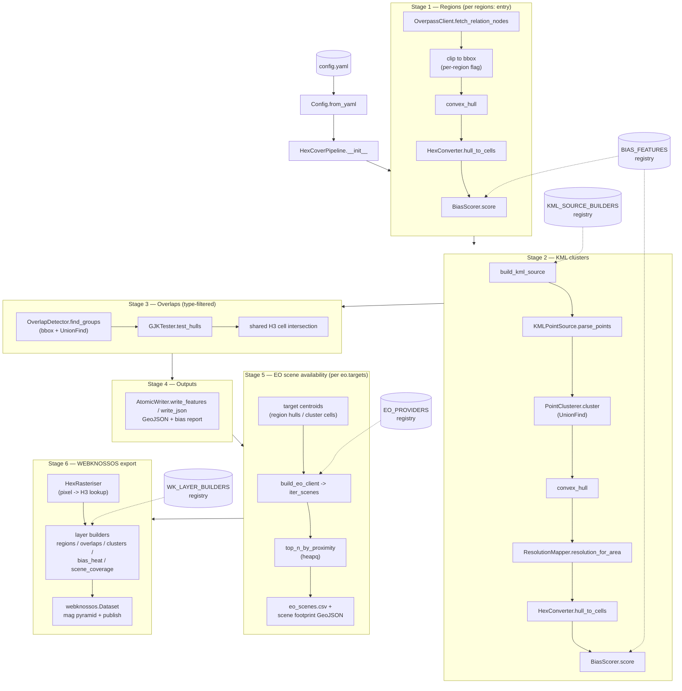

# hexcover

Region / KML cluster H3 hexagon covering pipeline with EO scene
availability and WEBKNOSSOS visualisation.

## Summary (PACES)

- **Problem** — Marine geospatial analysis repeatedly needs the same
  chain of operations: turn arbitrary named areas (seas, countries,
  survey zones from OSM relations) and scattered observation points
  (KML/KMZ, Zarr, OME-NGFF stores) into uniform H3 hexagon covers;
  quantify how spatially representative each cover is; detect where
  covers intersect; find which satellite scenes exist over them; and
  inspect the results at scale. Existing ad-hoc scripts hard-code the
  study area, mix concerns, depend on libraries with cross-OS friction
  (Numba JIT, PyQt6), and cannot be tested without network access.
- **Approach** — A single `config.yaml`-driven pipeline in which all
  variable behaviour is data, not code. Five decorator-populated
  registries (`BIAS_FEATURES`, `KML_SOURCE_BUILDERS`, `EO_PROVIDERS`,
  `WK_LAYER_BUILDERS`, and the config section table) make bias
  metrics, point sources, satellite catalogues, and visualisation
  layers selectable from YAML. Every external dependency — Overpass,
  KML sources, the EO client, the WEBKNOSSOS dataset factory — is an
  injectable constructor argument. The code follows NASA Power of 10
  (bounded loops, no recursion, hard limits asserted, atomic writes)
  and PEP 8, with pure-NumPy geometry replacing JIT-compiled paths.
- **Claim** — The pipeline SHALL retarget to any region set, bias
  feature set, EO provider, or layer selection through YAML edits
  alone; it SHALL run identically on macOS, Linux, and Windows; and
  its full behaviour SHALL be verifiable offline in seconds.
- **Evidence** — The offline test suite (10 modules, `uv run pytest`)
  exercises every stage end-to-end using the shipped `mocks` module:
  deterministic synthetic rings/clusters/scenes, scripted HTTP
  sessions, and recording fakes for Overpass, CDSE, Zarr, and
  WEBKNOSSOS. One test (`test_end_to_end_all_stages`) composes all
  four injection seams in a single pass with zero network calls, no
  Docker, and no optional installs.
- **Substantiation** — Algorithmic choices are standard and bounded:
  Andrew's monotone chain hulls (O(n log n), iteration-capped),
  iterative union-find with path halving for clustering and bbox
  components, Nesterov-accelerated 2D GJK for hull intersection,
  Shannon-entropy SRI / Gini / occupancy / dispersion over a fixed
  grid for spatial bias, and heap-based top-N proximity selection for
  EO scenes. Dependencies are limited to `h3`, `numpy`, `pandas`,
  `pyyaml`, `requests` — universal wheels only — with `zarr` and
  `webknossos` as optional extras behind lazy imports.

## Quickstart

```bash
uv sync
uv run hexcover --config config.yaml   # or: python -m hexcover
uv run hexcover-eo query --lat 55 --lon 3 --date 2026-07-01T12:00
uv run pytest                          # fully offline test suite
```

## Pipeline execution order

Click any node to jump to its source file.



Dotted edges mark the decorator-populated registries that make the
pipeline data-driven: `bias.features:`, `kml.source.type:`,
`eo.provider:`, and `webknossos.layers:` in YAML select behaviour at
run time with zero code changes.

## Configuration

Everything lives in [`config.yaml`](config.yaml). The key sections:

| Section      | Purpose                                                        |
|--------------|----------------------------------------------------------------|
| `pipeline`   | Base H3 resolution, optional global clip bbox                  |
| `regions`    | List of OSM relations: name, `relation_id`, free-form `type`, per-region clipping |
| `overlap`    | Which region types participate in pairwise GJK testing         |
| `limits`     | Hard caps asserted at run time (Power of 10 rule 2)            |
| `bias`       | Selected spatial-bias features and grid shape                  |
| `kml`        | Point source (`file` / `url` / `zarr` / `ngff_zarr`), clustering, area-to-resolution hierarchy |
| `eo`         | Provider, targets, collections, buffers, top-N per target      |
| `webknossos` | Layer selection, raster resolution, local/remote publishing    |
| `output`     | Every artefact path                                            |

Extension points MUST be added via the `@register` decorator; the
selected name then becomes valid YAML with no other change. Unknown
names fail fast at construction with the list of available options.

## Outputs

| Artefact                       | Contents                                   |
|--------------------------------|--------------------------------------------|
| `region_hexagons.geojson`      | H3 cover per region                        |
| `kml_cluster_hexagons.geojson` | Per-cluster covers at area-scaled resolution |
| `kml_hulls.geojson`            | Cluster convex hulls                       |
| `overlap_hexagons.geojson`     | Shared cells of GJK-intersecting pairs     |
| `combined_hexagons.geojson`    | Everything above, one FeatureCollection    |
| `geo_bias_report.json`         | Selected bias metrics per region/cluster   |
| `eo_scenes.csv`                | Scene availability rows per target         |
| `eo_scene_footprints.geojson`  | Scene footprint polygons                   |
| `output/webknossos/hexcover/`  | Multi-layer WEBKNOSSOS dataset             |

All writes are atomic (temp file + rename), so a crashed run never
leaves a truncated artefact.

## EO scene availability

With `eo.enabled: true`, the pipeline queries the Copernicus Data
Space (or any registered provider) for scenes near each target
centroid. Catalogue queries work unauthenticated; for downloads set
credentials in the environment — never in YAML:

```bash
export CDSE_USERNAME=... CDSE_PASSWORD=...
```

The standalone CLI covers single-point and voyage-CSV batch queries
independently of the pipeline:

```bash
uv run hexcover-eo query --lat 55 --lon 3 --date 2026-07-01T12:00
uv run hexcover-eo batch voyages.csv --output scenes.csv
```

## Visualising with WEBKNOSSOS (primary GUI)

Pipeline results are rasterised into a multi-layer WEBKNOSSOS dataset:
`regions`, `overlaps`, and `kml_clusters` as segmentation layers,
`bias_heat` (SRI intensity) and `scene_coverage` (EO acquisition
count) as colour layers.

### Run WEBKNOSSOS locally

```bash
docker compose up -d          # WEBKNOSSOS at http://localhost:9000
uv pip install 'hexcover[wk]'
uv run hexcover               # writes + copies dataset into ./binaryData
```

Set `webknossos.local.binary_data_dir: ./binaryData/sample_organization`
so the dataset appears in the local instance automatically (refresh
the dataset list in the WK dashboard). First-time setup: create an
organisation named `sample_organization` in the WK onboarding screen.
Give the Docker VM at least 6–8 GB RAM; on Intel Macs stuck on
macOS 12, Docker Desktop 4.41.2 is the last compatible release.

### Remote / hosted instance

Set `webknossos.remote.upload: true`, point `url` at the instance,
and export a token: `export WK_TOKEN=...` — tokens are read from the
environment only, never YAML.

## Offline demo mode

Everything external is injectable — Overpass, KML sources, the EO
client, and the WEBKNOSSOS dataset factory — so the pipeline runs with
no network, no Docker, and no optional installs:

```python
from hexcover.config import RegionConfig
from hexcover.kml_sources import InMemoryKMLSource
from hexcover.mocks import MockOverpassClient, demo_config, synthetic_clusters
from hexcover.pipeline import HexCoverPipeline

regions = (
    RegionConfig(name="Alpha", relation_id=101, type="country"),
    RegionConfig(name="Beta", relation_id=102, type="country"),
)
pipeline = HexCoverPipeline(
    demo_config("output_demo", regions=regions, kml_enabled=True),
    kml_source=InMemoryKMLSource(synthetic_clusters([(52.0, 1.0)])),
    overpass_client=MockOverpassClient.from_regions(regions),
)
pipeline.run()
```

## Architecture

Strictly layered dependency graph — nothing imports sideways:

```
decorators, config
        │
      utils
        │
geometry  bias  clustering  overlap  overpass  kml_sources  eo_client
        │                                            │
     eo_query                                   wk_export
        │                                            │
      mocks ──────────────────────────────────► pipeline, eo_cli
```

House conventions: frozen dataclasses hydrated by one generic YAML
mapper, `@register` registries for all extension points, injectable
collaborators at every network/filesystem seam, NASA Power of 10
compliance (bounded loops, assertions on limits, no recursion), and
autodocstring-format docstrings throughout.

## Licence and citation

Internal research tooling; add a licence before external release.
OSM data via Overpass is © OpenStreetMap contributors (ODbL);
Copernicus data terms apply to downloaded scenes.